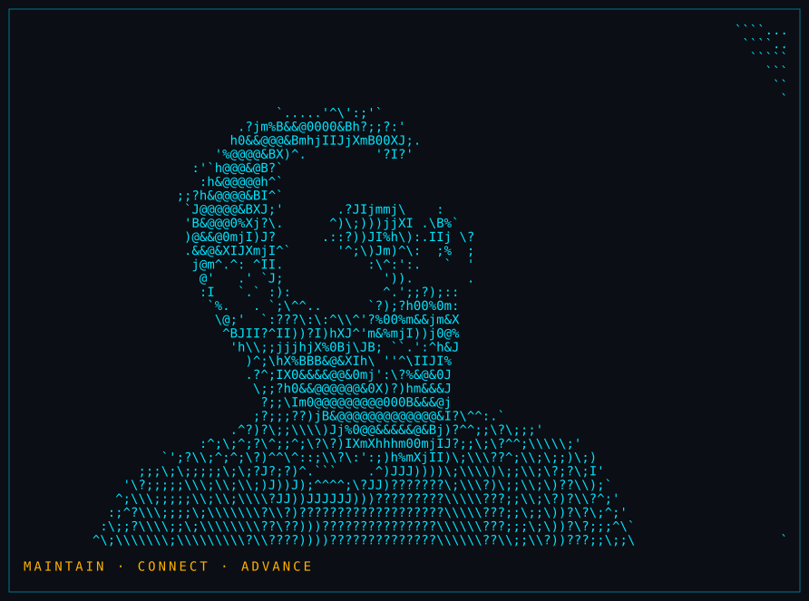

<!-- GOODNBAD.EXE · operator file -->
<!-- deck note: Batman = tone · Wrench = mask · the rest is signal, not noise -->

<table align="center">
  <tr>
    <td width="42%" valign="middle">
      
    </td>
    <td width="58%" valign="middle">
      
    </td>
  </tr>
</table>

# GOODNBAD.EXE // CYBERSECURITY × CREATIVE TECHNOLOGY

I build secure systems, automate messy work, and turn technical ideas into clear experiences.

`Maintain` · `Connect` · `Advance`

### ⌁ OPERATOR FILE

| field | value |
|:--|:--|
| `ROLE`     | Defensive security · DFIR · incident response |
| `BASE`     | Riyadh, SA |
| `STACK`    | Blue Team · Python · Web · Creative Systems |
| `DEFEND`   | Monitoring, incident response, and forensics on the systems people trust |
| `AUTOMATE` | Turning messy, manual work into reliable pipelines |
| `CRAFT`    | Code × art: interfaces that are clear and hard to ignore |
| `STATUS`   | `operational` — maintain · connect · advance |

### ⌁ RECENT SIGNAL

<!-- SIGNAL:START -->
- [**heyazah.sa**](https://github.com/Goodnbadexe/heyazah.sa) — new bweb  `PHP`
- [**MagicB**](https://github.com/Goodnbadexe/MagicB) — Overall, the Magic Browser combines intelligent search, privacy and security feature…  `HTML`
<!-- SIGNAL:END -->

### ⌁ CONTACT

[**Portfolio**](https://goodnbad.info) · [**LinkedIn**](https://www.linkedin.com/in/goodnbadexe/) · [**Email**](mailto:alramli.hamzah@gmail.com)

Cybersecurity graduate · defensive security · incident response · digital forensics

⌁ OPERATOR PORTRAIT — ASCII, rendered from a photograph

<picture>
  <source media="(prefers-color-scheme: dark)" srcset="./assets/portrait-dark.svg">
  <source media="(prefers-color-scheme: light)" srcset="./assets/portrait-light.svg">
  
</picture>

100 columns &#183; 21 glyphs, ramp calibrated by measured ink coverage

