<!-- GOODNBAD · profile identity -->
<!-- deck note: Batman = tone · Wrench = mask · the rest is signal, not noise -->

<table align="center">
  <tr>
    <td width="42%" valign="middle">
      
    </td>
    <td width="58%" valign="middle">
      
    </td>
  </tr>
</table>

# GOODNBAD // CYBERSECURITY × CODE × ART

**Security-minded builder from Riyadh.**
I defend the systems people trust — turning code, forensics, and visual
thinking into work that is safer, clearer, and harder to ignore.

`Maintain` · `Connect` · `Advance`

Cybersecurity graduate — **defensive security · incident response · digital forensics**

 

`Blue Team` · `DFIR` · `Python` · `Web` · `Creative Systems`

 

[**Portfolio**](https://goodnbad.info) · [**LinkedIn**](https://www.linkedin.com/in/goodnbadexe/) · [**Email**](mailto:alramli.hamzah@gmail.com)

